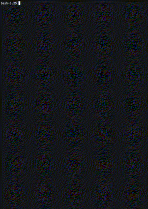
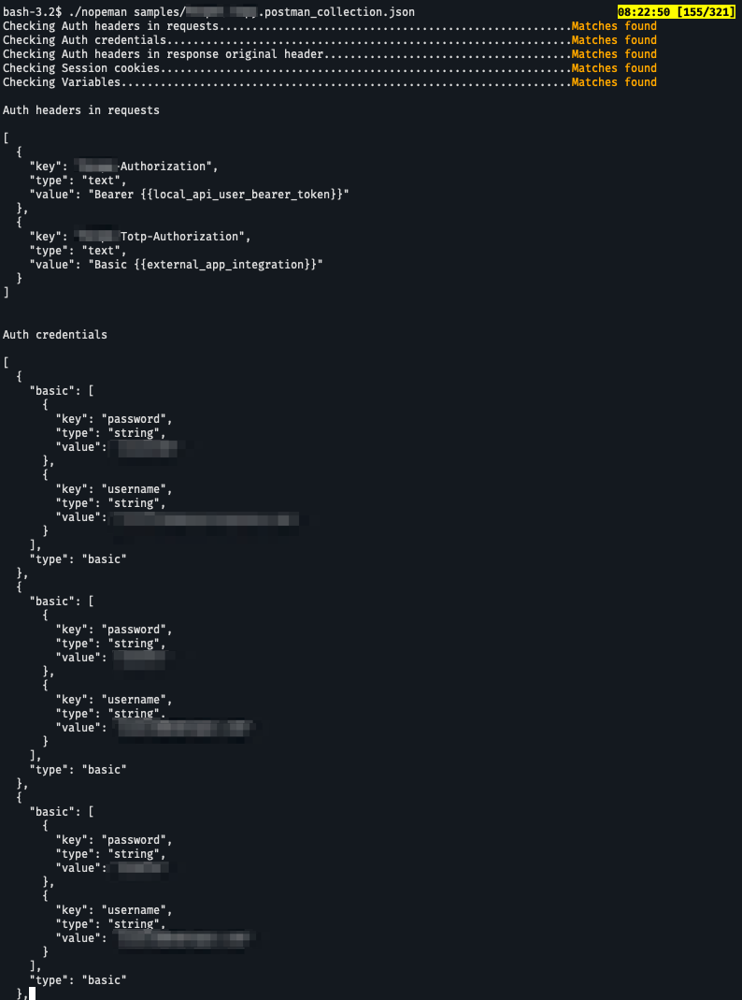

# Nopeman

Nopeman "suspects" your Postman collection contains sensitive data.  
Nopeman checks the collection before you share it with confidence.



## Requirements

- [x] First install [jp](https://github.com/jmespath/jp#installing)

## Usage

```bash
nopeman <inputfile>
```

## Download

1. Choose the latest passing build from the [actions tab](https://github.com/aldnav/nopeman/actions)
2. Select the artifact that matches your OS and architecture
3. Download the artifact
4. Extract and allow execution
    1. Mac: Do not move to trash and cancel. Then allow from the System Preferences > Privacy and Security. Run again.
5. Create or copy the `redact.yml` file to the same directory as the executable

## Sample output



## Configuration

Edit the `redact.yml` file to add/remove rules.

```yaml
- name: Display name of the rule
  match: "[]" # JMESPath query to match the data you want to redact
```
